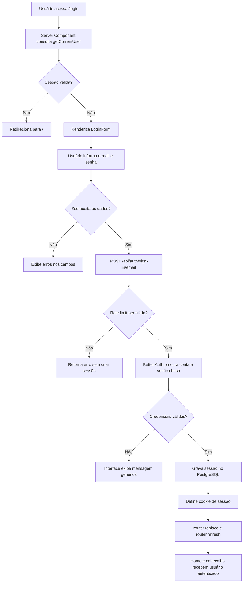
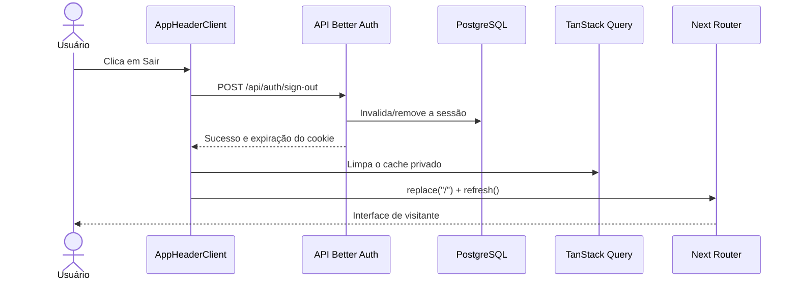

# Documentação técnica — Login

## 1. Objetivo e escopo

A funcionalidade de login autentica usuários por e-mail e senha e cria uma sessão persistente para liberar recursos privados do Conversor de Moedas, principalmente o histórico de conversões.

O escopo de autenticação da aplicação inclui:

- criação de conta com e-mail e senha;
- login com credenciais existentes;
- leitura da sessão no servidor;
- apresentação do estado autenticado no cabeçalho;
- logout e remoção dos dados privados mantidos no cache do navegador.

Não fazem parte do produto: login social, perfil, alteração de e-mail ou senha, exclusão de conta, recuperação de senha e verificação de e-mail. Os endpoints correspondentes são desabilitados na configuração do servidor.

## 2. Visão geral da arquitetura

A autenticação é implementada com as seguintes camadas:

| Camada | Responsabilidade | Implementação principal |
| --- | --- | --- |
| Interface | Coletar credenciais, validar o formulário e apresentar estados de erro/carregamento | React, Material UI, React Hook Form e Zod |
| Cliente de autenticação | Enviar requisições HTTP para os endpoints de autenticação | `better-auth/react` |
| Route Handler | Expor a API HTTP do Better Auth no Next.js | `src/app/api/auth/[...all]/route.ts` |
| Serviço de autenticação | Validar credenciais, aplicar limites, emitir e validar sessões | Better Auth |
| Persistência | Armazenar usuários, hashes de senha, sessões e rate limits | PostgreSQL, Drizzle ORM e adapter Drizzle v2 |
| Consumo da sessão | Disponibilizar `{ id, email }` a componentes e procedimentos protegidos | `getCurrentUser` e contexto tRPC |

Os componentes nunca acessam o banco diretamente. O navegador se comunica com o Route Handler por HTTP, e somente os módulos marcados como `server-only` acessam o serviço de autenticação e a conexão com o banco.

## 3. Descrição funcional

### 3.1. Página de login

A página `/login` é renderizada inicialmente no servidor. Antes de exibir o formulário, ela consulta a sessão atual por meio de `getCurrentUser()`. Se o usuário já estiver autenticado, ocorre um redirecionamento para `/`.

Para visitantes, a página apresenta:

- campo de e-mail;
- campo de senha com controle para mostrar ou ocultar o conteúdo;
- botão **Entrar**;
- link para `/register`;
- mensagem genérica quando as credenciais não são aceitas.

Durante o envio, os campos e o botão permanecem desabilitados e um indicador de progresso é exibido. Isso evita submissões concorrentes pela interface.

### 3.2. Validação do formulário

A validação no cliente usa Zod por meio do `zodResolver`:

- o e-mail é obrigatório e precisa ter formato válido;
- a senha deve conter entre 8 e 128 caracteres.

Antes da requisição, o e-mail é normalizado com remoção de espaços nas extremidades e conversão para letras minúsculas. Essa normalização também é aplicada pelo servidor durante o cadastro, e o banco possui unicidade sobre `lower(email)`.

A validação do cliente melhora a experiência, mas não substitui a validação e autenticação realizadas pelo Better Auth no servidor.

### 3.3. Autenticação e criação de sessão

O formulário chama `authClient.signIn.email`, que envia uma requisição para `POST /api/auth/sign-in/email`. O Better Auth:

1. localiza o usuário e sua conta de credencial;
2. compara a senha informada com o hash armazenado;
3. aplica o rate limit configurado para o endpoint;
4. cria uma sessão quando as credenciais são válidas;
5. envia ao navegador o cookie da sessão.

O hash de senha é produzido e verificado pelo Better Auth usando sua implementação padrão baseada em `scrypt`. A aplicação nunca persiste nem registra a senha em texto puro.

### 3.4. Resultado do login

Em caso de sucesso, o cliente executa `router.replace("/")` e `router.refresh()`. O `replace` impede que o formulário de login permaneça como etapa útil no histórico de navegação, enquanto o `refresh` força os Server Components a relerem a sessão recém-criada.

Em caso de falha, a interface mostra apenas **“E-mail ou senha inválidos. Verifique os dados e tente novamente.”**. A mensagem não revela se o e-mail existe, reduzindo enumeração de contas.

### 3.5. Uso da sessão

`getCurrentUser()` encaminha os cabeçalhos da requisição atual para `auth.api.getSession()`. O resultado é reduzido ao contrato mínimo `{ id, email }` antes de chegar à interface.

A sessão é usada em dois pontos principais:

- no `AppHeader`, para alternar entre os links **Entrar/Criar conta** e o e-mail com o botão **Sair**;
- no contexto tRPC, para autorizar procedimentos protegidos, como listagem e remoção do histórico.

A duração da sessão é de sete dias. O Better Auth pode atualizar sua validade após um dia de uso (`updateAge` de 24 horas).

### 3.6. Logout

O botão **Sair** chama `authClient.signOut()`. Após o sucesso:

- a sessão é invalidada pelo backend;
- o cache do TanStack Query é limpo para remover dados privados, como o histórico;
- a navegação retorna para `/`;
- `router.refresh()` atualiza os componentes renderizados no servidor.

O estado de carregamento é encerrado em um bloco `finally`, inclusive quando a requisição falha, evitando que o botão permaneça permanentemente desabilitado.

## 4. Diagramas de fluxo

### 4.1. Abertura da página e login



### 4.2. Logout



## 5. Interfaces necessárias

### 5.1. Interfaces de usuário

| Componente | Tipo | Responsabilidade |
| --- | --- | --- |
| `LoginPage` | Server Component | Bloquear acesso de usuários já autenticados e compor a página |
| `AuthPageShell` | Server-compatible UI | Fornecer cartão, título e descrição compartilhados entre login e cadastro |
| `LoginForm` | Client Component | Gerenciar formulário, submissão, carregamento e erro global |
| `EmailField` | Client Component reutilizável | Capturar e-mail com semântica e autocomplete adequados |
| `PasswordField` | Client Component reutilizável | Capturar senha e permitir mostrar/ocultar o valor |
| `AppHeader` | Server Component | Resolver o usuário atual antes de renderizar o cabeçalho |
| `AppHeaderClient` | Client Component | Exibir estado da conta e executar logout responsivo |

Os campos usam rótulos visíveis, mensagens associadas e controles acessíveis. O botão de visibilidade possui `aria-label` dinâmico (**Mostrar senha** ou **Ocultar senha**).

### 5.2. Contratos TypeScript e validação

```ts
type LoginFormValues = {
  email: string;
  password: string;
};

type RegisterFormValues = {
  email: string;
  password: string;
  passwordConfirmation: string;
};

type CurrentUser = {
  id: string;
  email: string;
};
```

Os tipos dos formulários são inferidos dos schemas Zod definidos em `src/features/auth/contracts.ts`. `CurrentUser` é deliberadamente pequeno para evitar enviar ao cliente campos internos do Better Auth.

### 5.3. Interface HTTP

Todos os endpoints abaixo são servidos pelo Route Handler catch-all `/api/auth/[...all]`:

| Método e rota | Entrada principal | Resultado | Uso |
| --- | --- | --- | --- |
| `POST /api/auth/sign-in/email` | `{ email, password }` | Sessão e cookie, ou erro de autenticação | Login |
| `POST /api/auth/sign-up/email` | `{ name, email, password }` | Usuário, sessão e cookie, ou erro | Cadastro auxiliar |
| `GET /api/auth/get-session` | Cookie enviado automaticamente | Sessão e usuário, ou ausência de sessão | Leitura de sessão |
| `POST /api/auth/sign-out` | Cookie enviado automaticamente | Invalidação da sessão e do cookie | Logout |

O campo `name` exigido tecnicamente pelo Better Auth recebe sempre `"User"`. Um hook de banco no servidor sobrescreve qualquer nome recebido, garantindo que ele não se torne dado editável ou visível do produto.

Rotas de modificação de conta, senha, e-mail, exclusão, recuperação, verificação e vinculação social constam em `disabledPaths` e não são expostas pela aplicação.

## 6. Banco de dados e armazenamento

O banco usado é PostgreSQL, acessado pelo Drizzle ORM. IDs são UUIDs gerados no banco.

### 6.1. Tabela `users`

| Coluna | Finalidade |
| --- | --- |
| `id` | Identificador do usuário |
| `name` | Valor técnico fixo `User`, não exibido nem editável |
| `email` | Identidade usada no login |
| `email_verified` | Campo de infraestrutura; permanece falso neste escopo |
| `image` | Campo de infraestrutura; permanece nulo neste escopo |
| `created_at`, `updated_at` | Auditoria temporal |

O índice único `users_email_unique` usa `lower(email)`, impedindo duplicidade por diferença entre maiúsculas e minúsculas.

### 6.2. Tabela `accounts`

Armazena a identidade de autenticação associada ao usuário. No login por e-mail e senha, a coluna `password` contém somente o hash produzido pelo Better Auth. A relação `accounts.user_id -> users.id` usa `ON DELETE CASCADE`.

O índice único formado por `provider_id` e `account_id` impede duplicidade da mesma conta no provedor.

### 6.3. Tabela `sessions`

Armazena sessões ativas com:

- token único;
- usuário proprietário;
- data de expiração;
- datas de criação e atualização;
- IP e user agent, quando disponíveis.

A relação com `users` também usa exclusão em cascata. Há índices por `user_id` e `expires_at` para favorecer consultas e manutenção das sessões.

### 6.4. Tabela `rate_limits`

Persiste a chave de limitação, o contador e o instante da última requisição. A persistência no banco mantém o controle consistente entre reinícios e entre múltiplas instâncias da aplicação.

Regras específicas:

- login: até 5 tentativas por janela de 60 segundos;
- cadastro: até 3 tentativas por janela de 60 segundos.

O IP é obtido dos cabeçalhos `x-forwarded-for` ou `x-real-ip`, que devem ser definidos apenas por um proxy reverso confiável em produção.

### 6.5. Tabela `verifications`

Existe por compatibilidade com o schema do Better Auth. Como verificação de e-mail e recuperação de senha estão desabilitadas, ela não participa do fluxo atual de login.

### 6.6. Cookie e armazenamento no navegador

A sessão é referenciada por cookie configurado com:

- `HttpOnly`, impedindo leitura por JavaScript;
- `SameSite=Lax`, reduzindo o envio em navegações cross-site inadequadas;
- `Secure` em produção, restringindo o transporte a HTTPS;
- `Path=/`, tornando a sessão válida para toda a aplicação.

Credenciais não são armazenadas em `localStorage` ou `sessionStorage`. No logout, o cache em memória do TanStack Query é limpo para que respostas privadas não permaneçam disponíveis na interface.

## 7. Serviços e dependências envolvidos

### 7.1. Better Auth

Better Auth é a biblioteca responsável por endpoints, hash e verificação de senha, emissão e leitura de sessão, cookies e rate limiting. O adapter `@better-auth/drizzle-adapter/relations-v2` integra o serviço às tabelas Drizzle.

Embora seja uma dependência externa do projeto, ela é executada dentro do backend da aplicação; o fluxo de login não depende de uma API SaaS de terceiros.

### 7.2. PostgreSQL

É o único serviço externo de infraestrutura necessário ao login. A conexão é configurada por `DATABASE_URL`.

### 7.3. Serviços não utilizados

O login não usa FreecurrencyAPI, provedores OAuth, serviço de e-mail, SMS ou serviço externo de identidade. A FreecurrencyAPI participa apenas da funcionalidade de conversão monetária.

## 8. Configuração por ambiente

| Variável | Obrigatória | Finalidade |
| --- | --- | --- |
| `DATABASE_URL` | Sim | String de conexão com o PostgreSQL |
| `BETTER_AUTH_SECRET` | Sim | Segredo de assinatura/proteção da autenticação; deve ter pelo menos 32 caracteres e não ser versionado |
| `BETTER_AUTH_URL` | Sim | URL pública base da aplicação |
| `BETTER_AUTH_TRUSTED_ORIGINS` | Conforme o ambiente | Lista separada por vírgulas das origens autorizadas |

Em produção, a aplicação deve operar exclusivamente por HTTPS para que cookies `Secure` funcionem corretamente. Cada ambiente deve possuir um segredo próprio e origens confiáveis restritas aos domínios esperados.

## 9. Tratamento de erros e segurança

- Falhas de credencial produzem mensagem genérica na interface.
- Senhas aceitas possuem entre 8 e 128 caracteres.
- O hash de senha fica separado do registro principal do usuário, em `accounts.password`.
- Cookies de sessão são `HttpOnly`, `SameSite=Lax` e `Secure` em produção.
- Login e cadastro possuem rate limit persistente.
- E-mails são normalizados e protegidos por índice único case-insensitive.
- Páginas de autenticação redirecionam usuários que já possuem sessão.
- Procedimentos privados validam a sessão novamente no backend; ocultar componentes no frontend não é considerado autorização.
- Módulos que acessam autenticação e banco são marcados como `server-only`.
- Endpoints fora do escopo de gestão de conta são desabilitados.

## 10. Estrutura de arquivos relacionada

```text
src/
├── app/
│   ├── api/auth/[...all]/route.ts      # Route Handler do Better Auth
│   ├── login/page.tsx                  # Página e proteção do login
│   └── register/page.tsx               # Página e proteção do cadastro
├── components/layout/
│   ├── app-header.tsx                  # Leitura server-side do usuário
│   └── app-header-client.tsx           # Estado visual e logout
├── db/
│   ├── client.ts                       # Cliente PostgreSQL/Drizzle
│   └── schema.ts                       # users, accounts, sessions etc.
├── features/auth/
│   ├── client.ts                       # Cliente Better Auth do navegador
│   ├── contracts.ts                    # Schemas Zod e tipos públicos
│   ├── components/                     # Formulários e campos
│   └── server/
│       ├── auth.ts                     # Configuração do Better Auth
│       └── session.ts                  # getCurrentUser
└── trpc/init.ts                        # Sessão no contexto das APIs tRPC
```

## 11. Verificação e testes

O arquivo `docs/Acceptance Criteria.md` é a fonte de verdade para a aceitação do produto. A cobertura é distribuída conforme a natureza de cada requisito: regras puras ficam em testes unitários; comportamento visual isolado, em testes de componente; persistência e autorização, em integração; e jornadas, responsividade e navegação, em E2E. Essa divisão evita testes unitários que apenas simulam banco, cookies ou navegação e produziriam uma falsa indicação de segurança.

### 11.1. Rastreabilidade dos critérios de login

| Critério de aceitação | Nível | Evidência principal |
| --- | --- | --- |
| Cadastro solicita somente e-mail, senha e confirmação | Componente | `register-form.test.tsx` |
| Formato, normalização e unicidade case-insensitive do e-mail | Unitário + integração | `contracts.test.ts`, `register-form.test.tsx` e `auth-integration.mts` |
| Senha entre 8 e 128 caracteres | Unitário + integração | `contracts.test.ts` e configuração verificada por `acceptance-architecture.test.ts` |
| Senha mascarada e ação acessível de visibilidade | Componente | `form-fields.test.tsx`, `login-form.test.tsx` e `register-form.test.tsx` |
| Requisito e confirmação de senha no cadastro | Unitário + componente | `contracts.test.ts` e `register-form.test.tsx` |
| Login e cadastro redirecionam após sucesso | Componente + E2E | testes dos formulários e `currency-converter.spec.ts` |
| Cadastro produz login automático | Integração + E2E | `auth-integration.mts` e fluxo completo do Playwright |
| Credenciais inválidas geram mensagem genérica | Componente + integração + E2E | `login-form.test.tsx`, `auth-integration.mts` e Playwright |
| Usuário autenticado não acessa `/login` ou `/register` | E2E | `currency-converter.spec.ts` |
| Sessão dura sete dias e sobrevive ao recarregamento | Estrutural + integração + E2E | `acceptance-architecture.test.ts`, leitura de sessão em `auth-integration.mts` e recarga no Playwright |
| Logout limpa cache e dados privados | Componente + integração + E2E | `app-header-client.test.tsx`, `auth-integration.mts` e Playwright |
| Senha é armazenada somente como hash | Integração | consulta de `accounts.password` em `auth-integration.mts` |
| Cookie `HttpOnly`, `SameSite=Lax` e `Secure` em produção | Integração + estrutural | atributos reais do cookie em `auth-integration.mts` e política de produção em `acceptance-architecture.test.ts` |
| Rate limit persistente de login e cadastro | Estrutural + integração | configuração e tabela verificadas pela suíte; persistência real exercitada em `auth-integration.mts` |
| Endpoints de gestão de conta permanecem bloqueados | Integração | todos os caminhos desabilitados são exercitados em `auth-integration.mts` |
| Cabeçalho diferencia visitante e autenticado | Componente + E2E | `app-header-client.test.tsx` e Playwright desktop/móvel |
| Somente `{ id, email }` chega à interface | Unitário/estrutural | contrato `CurrentUser` e `acceptance-architecture.test.ts` |

### 11.2. Rastreabilidade da aplicação completa

Além do login, a suíte foi ampliada para cobrir todas as seções de `docs/Acceptance Criteria.md`:

| Seção dos critérios | Cobertura automatizada |
| --- | --- |
| Escopo do produto | Teste estrutural das páginas e E2E das três rotas |
| Conversão de moedas | Contratos, cálculo decimal, formatação, seletor e cartão do conversor |
| Taxas de câmbio | Transformação de payload, requisições do provider, header `apikey`, caches e tradução de falhas |
| Cadastro, login e sessão | Contratos, formulários, integração Better Auth/PostgreSQL e E2E |
| Cabeçalho e navegação | Testes de componente e navegação desktop/móvel |
| Histórico | Contratos, DTOs, paginação, componentes, integração com banco e E2E |
| API, arquitetura e integridade | Serviços, contratos tRPC, teste estrutural e integração com PostgreSQL |
| Interface e acessibilidade | Componentes com queries semânticas, `aria-live`, idioma, contraste, toque mínimo, viewport móvel e movimento reduzido |
| Segurança e privacidade | Autorização/isolamento em integração, mensagens públicas, cookies, hash e verificações estruturais |
| Testes e conclusão | Comandos de qualidade executados como condição de entrega |

Os testes unitários e de componente são isolados pelo `cleanup` global do React Testing Library. A FreecurrencyAPI é sempre simulada nos testes, e os testes de integração usam registros descartáveis no PostgreSQL.

Comandos relevantes:

```bash
npm test
npm run test:auth-integration
npm run test:e2e
npm run lint
npm run typecheck
```

Os testes de integração devem usar um banco separado ou dados descartáveis. Segredos reais e credenciais de usuários não devem aparecer em fixtures, logs ou arquivos versionados.
